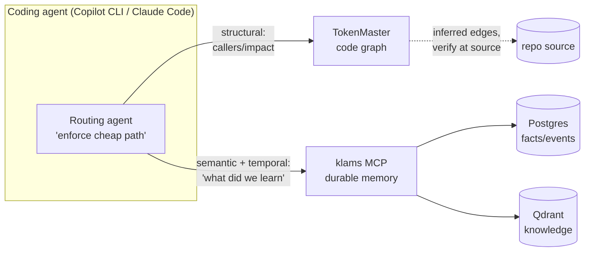

# Analysis: TokenMaster and klams

**Status:** Exploratory analysis  
**Date:** 2026-06-09  
**Companion:** [future-synergies.md](future-synergies.md)

This document reviews TokenMaster, restates what klams is in the same frame,
explains why the two are complementary, and lays out the integration options
that are achievable against **both systems as they exist today** (no new
TokenMaster or klams features assumed). Future-looking work lives in the
companion document.

---

## 1. What TokenMaster is

TokenMaster (TMX) is a **harness-layer routing plugin** for Claude Code and the
GitHub Copilot CLI. It is not a model, not a library, and not a memory store —
it is a thin layer that changes *what the agent re-reads on every turn*.

### 1.1 The thesis

The README's argument, restated:

- The model has **no memory between turns**. To continue a task the harness
  re-sends the entire transcript every turn, and the model re-reads all of it.
- So the real cost is not *tokens sent once* but **cumulative tokens processed,
  summed across every turn** — "the area under the curve" of context size.
- A grep-and-re-read loop makes that area balloon: turn 7 re-reads what turn 1
  saw, six times over. A bounded graph query keeps the area tiny.
- Therefore: **pay once to understand a codebase's structure, then never
  again.** Structural questions should be answered from a prebuilt graph, not
  re-derived by grep.

### 1.2 The mechanism

TMX has three moving parts:

1. **A prebuilt code graph** per repo, stored at `.token-master/graph.json`
   (git-ignored). Two interchangeable suppliers:
   - `graphify` (default) — a fast, **no-LLM** structural index. Its `calls`
     edges are **name-inferred** candidates (~0.8 confidence), explicitly
     framed as a candidate generator the caller must verify at `file:line`.
   - `codegraph` (escalation) — **AST-resolved** call edges. Precise but ~2–4×
     the tokens; used only when inference can't be trusted (name collisions,
     sparse JS/TS call graphs, security/refactor work needing exact sites).
2. **A graph-query MCP server** (`graphify_mcp.py`, FastMCP) that exposes the
   graph behind intent-named tools: `find`, `callers`, `callees`, `impact`
   (transitive blast radius), `inheritors`, `explain`. Every response carries
   caps (`MAX_DEFS`, `MAX_ROWS`) to stay token-bounded and an honesty note that
   inferred edges must be verified.
3. **A routing agent** (`agent.template.{claude,copilot}.md`) installed into the
   user-scope CLI home. This is the load-bearing piece: it makes the graph the
   **default** path for structural questions. TMX's own finding is that the
   model reached for the graph **0/15 times** when it was merely *offered*, and
   **8/8** once routing was enforced. "Offering saves nothing; enforcing
   collapses the area under the curve."

### 1.3 The "temporal layer" — and the gap

TMX's backend table lists a third layer beyond the two graph suppliers:

> **Temporal** — host CLI session memory — native cross-session recall, no
> extra server.

The agent template is candid that this is a **stopgap**, not real memory:

- It is **lexical** (FTS5 keyword search over past turns), not semantic.
- It is **opt-in** — nothing is injected automatically; the agent must query.
- It is **per-CLI-home** — scoped to one machine's `~/.copilot` or `~/.claude`.
- `--resume` replays the **full transcript re-billed as input** (no
  compression), so it is only worth it after a large investigation.
- The template explicitly says: "Do not promise claude-mem-style automatic
  semantic memory — native Copilot does keyword recall over raw turns and
  full-transcript resume, nothing more."

**This gap is the integration surface.** TMX nails structural/spatial recall and
deliberately leaves durable, semantic, cross-session, cross-agent memory
unsolved. That is precisely what klams is.

### 1.4 Scope and honesty

TMX is disciplined about its claims: it wins on hard multi-hop traversal
(blast-radius up to 7.8× fewer tokens), is **correctly neutral** on short
questions grep nails in ~3 turns, and reports negative results (an inheritor
lookup that ran −44%). It optimizes **cumulative tokens, not dollars**.

---

## 2. What klams is (in the same frame)

klams is a **controller-centric, durable, multi-agent memory service** (Rust,
on `kubs0`) exposing a persistent MCP server. Where TMX is per-session and
per-repo, klams is persistent and cross-everything.

| klams capability | Where it lives |
|------------------|----------------|
| **Facts** (user/task/agent), with `source`-derived trust, decay, dissents, attribution | Postgres (`klams-store`), written via the bounded queue in `klams-core` |
| **Events** (execution traces, sprint state) | Postgres, FTS-searchable |
| **Knowledge** — embedded semantic content from repos, vault, specs | Qdrant vectors via TEI embeddings |
| **Repo scanning** — walks repos, chunks files, embeds → knowledge | `klams-scanner` (hourly systemd timer; honours `.gitignore`/`.klamsignore`) |
| **MCP surface** | `klams-mcp`: `memory_search` (federated FTS + ANN), `memory_related` (vector neighbours), `memory_add`, `memory_append_event`, `event_search`, `register_author`, `memory_delete`, admin tools |
| **Attribution / governance** | authors table, trust ranking, dissents, soft-delete + restore |

Critically, klams **already walks repositories** (`klams-scanner::walk`) and
**already serves semantic search over their contents** to any agent on the LAN.
It is durable, observable (Prometheus), and shared across agents and machines.

---

## 3. Why they are complementary, not competing

Lay the two side by side and the seams line up almost perfectly:

| Dimension | TokenMaster | klams |
|-----------|-------------|-------|
| Question type | **Structural / spatial** ("who calls X", "what breaks if I change Y", "what inherits Z") | **Semantic + factual + temporal** ("what did we learn about X", "what is Ken's GPU layout", "what happened in this sprint") |
| Representation | Code graph (nodes + typed edges) | Embeddings + relational facts/events |
| Lifetime | Per-session, per-repo, ephemeral (`graph.json`) | Durable, versioned, decaying |
| Scope | One CLI home / one machine | All agents, all machines (homelab-wide) |
| Memory across sessions | Borrowed lexical session store (stopgap) | Native, semantic, attributed |
| Killer move | **Routing enforcement** — making the cheap path the default | **Durable shared substrate** — one source of truth |
| Optimizes | Cumulative token economics ("area under curve") | Memory durability, trust, retrieval quality |

The overlap is small and the gaps are mutual:

- TMX has **no durable semantic memory**; klams *is* one.
- klams has **no structural code graph** (it is a backlog item — see §5); TMX
  builds one in seconds.
- TMX proved a behavioural insight klams hasn't yet operationalized —
  **enforce the cheap path, don't merely offer it** (0/15 → 8/8).
- klams has infrastructure TMX lacks — a durable store, a repo scanner that
  already walks code, attribution, and a LAN-wide MCP endpoint.



---

## 4. Near-term integration options (no new features required)

These work against **both systems as they ship today**. They are ordered by
effort, lowest first.

### Option A — klams as TokenMaster's temporal/semantic supplier (recommended first step)

**What:** Point TMX's routing agent at the klams MCP endpoint as an additional
MCP server, and rewrite the "Cross-session memory" section of the agent
template to prefer klams `memory_search` / `memory_add` over the lexical
FTS5 session store for durable recall.

**Why it fits cleanly:**

- TMX's agent template already declares MCP servers inline (`mcp-servers:` in
  `agent.template.copilot.md`). Adding a `klams` stdio/HTTP server is a
  template edit, not a code change.
- klams already exposes exactly the verbs the temporal layer wants:
  `memory_search` (federated semantic + FTS recall) and `memory_add` (durable
  write). No klams change required.
- It upgrades TMX's weakest, self-acknowledged layer (lexical, opt-in,
  per-home) to semantic, durable, cross-agent recall — without touching the
  graph half that TMX is strong at.

**Shape:**

```text
Structural question  → graphify-nav / codegraph   (unchanged, TMX's strength)
Recall question      → klams memory_search          (was: FTS5 session store)
Durable finding      → klams memory_add              (was: nothing persisted)
```

**Caveats:** klams is bearer-authed and homelab-scoped — the routing agent only
reaches it on the LAN, which matches Ken's environment but is not a
general-public default. TMX would document klams as an *optional* supplier, the
same way `codegraph` is optional today.

### Option B — Feed TokenMaster's graph into klams as knowledge/events

**What:** After `/token-master` builds `.token-master/graph.json`, a small
adapter publishes a digest of it into klams — e.g. one knowledge item per
symbol (label + location + neighbour summary) and/or events recording
high-value structural facts ("`force_str` has 41 callers across 9 files").

**Why:** It makes the graph's findings **durable and searchable by other
agents** without those agents running TMX. klams's existing semantic search
then surfaces structural context alongside prose. The scanner already publishes
chunks via `klams-client`; the same publish path accepts these.

**Caveats:** This is a *projection*, not a live graph — it answers "tell me
about X" semantically, not "walk callers of X" precisely. It complements, not
replaces, Option A. Inferred edges must keep their confidence/honesty caveat
when stored.

### Option C — Adopt TokenMaster's routing-enforcement pattern for klams's own MCP

**What:** Borrow TMX's agent-template idea for klams: ship a klams routing
agent template (Copilot/Claude) that makes `memory_search` the **default** for
recall-shaped questions, instead of relying on the model to remember to call it.

**Why:** TMX's measured 0/15 → 8/8 result is the most transferable lesson in
the whole project: a memory tool the model never calls saves nothing. klams has
a rich MCP surface that agents under-use for the same reason. This is a
docs/template deliverable, not a code change, and it pays off independently of
whether TMX is installed.

**Caveats:** Routing rules need tuning so klams isn't queried for things it
can't answer (it has no structural graph yet — see §5).

---

## 5. The backlog already points here

klams's own backlog ([../backlog.md](../backlog.md)) contains two items that
are essentially "build the TokenMaster half inside klams":

- **"Lightweight graph memory"** — *"Add a relationship/edge layer over facts
  and knowledge items for multi-hop queries."* This is the structural graph TMX
  ships, expressed in klams's roadmap.
- **"Multi-vector embeddings (text + code)"** — separate embedding spaces for
  prose vs source, which pairs naturally with a code graph.

That convergence is the strongest signal that integration is worth pursuing:
the two projects are independently walking toward the same midpoint. The
near-term options above let klams benefit from TMX's graph **immediately**
(Options A/B) while the deeper "klams hosts the graph" direction (the backlog
item) matures — that deeper direction is covered in
[future-synergies.md](future-synergies.md).

---

## 6. Recommendation

1. **Start with Option A.** Lowest effort, highest leverage, no code in either
   repo beyond an agent-template edit. It directly fills TMX's acknowledged gap
   with klams's core strength and validates the partnership end-to-end.
2. **Add Option C in parallel.** The routing-enforcement insight improves klams
   on its own and is the prerequisite mindset for any deeper integration.
3. **Treat Option B as opportunistic.** Useful once A is in place and you want
   non-TMX agents to see structural context.
4. **Defer the deep "klams hosts the graph" work** to the future-looking track
   until A/C have proven the seams in practice.
