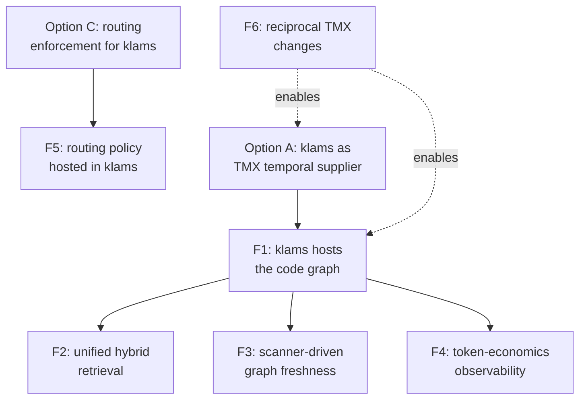

# Future-looking synergies: TokenMaster × klams

**Status:** Future-looking — requires new work  
**Date:** 2026-06-09  
**Companion:** [analysis.md](analysis.md)

> **Read this as aspiration, not plan.** Everything in [analysis.md](analysis.md)
> §4 works against both systems *as they exist today*. Everything below
> **requires new features** in klams, TokenMaster, or both. Each item names the
> load-bearing change so it's clear what would have to be built. Nothing here is
> scheduled or committed.

---

## F1. klams hosts the structural code graph (the big one)

**Idea:** Move the code graph out of a per-repo `.token-master/graph.json` and
into klams as a durable, shared **edge layer** over its existing facts and
knowledge items — then expose `callers` / `callees` / `impact` / `inheritors`
as first-class klams MCP tools.

**Why it's compelling:**

- It directly realizes the **"Lightweight graph memory"** backlog item
  ([../backlog.md](../backlog.md)) — *"a relationship/edge layer over facts and
  knowledge items for multi-hop queries."*
- The graph becomes **durable and homelab-wide**: every agent on every machine
  queries one graph, instead of each CLI home rebuilding `graph.json`.
- The graph stays **fresh automatically**: `klams-scanner` already walks repos
  hourly (honouring `.gitignore`/`.klamsignore`) and publishes chunks. It could
  emit graph edges in the same pass — eliminating TokenMaster's manual "re-run
  `/token-master` when the graph is stale" step.
- klams's **attribution + trust + decay** machinery applies to edges too:
  inferred edges (graphify-style, ~0.8) vs resolved edges (codegraph-style)
  map onto klams's existing confidence/source model, and stale edges can decay.

**Load-bearing new work (klams):**

- A graph/edge schema in Postgres (nodes ↔ symbols, typed edges:
  `calls`/`inherits`/`uses`/`imports`, with confidence + source_location).
- Edge-extraction in the scanner. The honest option is to **embed or shell out
  to `graphify`** (or port its no-LLM heuristics to Rust) rather than reinvent
  AST resolution; `codegraph` remains the precision escalation.
- New MCP tools mirroring TMX's verb set, with the same token-bounded caps and
  inferred-edge honesty notes that make TMX's server safe.

**Load-bearing new work (TokenMaster):**

- A "klams" graph supplier in the routing agent's backend table, selectable the
  way `graphify` vs `codegraph` is today — so TMX can point at klams's hosted
  graph instead of a local file when one is available.

**Net result:** one durable store answers **structural + semantic + temporal**
questions for every agent, queried by a TokenMaster-style routing agent that
enforces the cheap path. That is the full union of both projects.

---

## F2. Unified hybrid retrieval (structural ⊕ semantic ⊕ temporal)

**Idea:** Extend klams `memory_search` so a single query can fuse the graph
edge layer (F1) with the existing Qdrant semantic search and Postgres facts/
events — returning, for "tell me about `force_str`", both *what it structurally
connects to* and *what we've learned about it over time*, ranked together.

**Why:** Today these are separate lookups. A fused answer is what an agent
actually wants ("what is this, what touches it, and what bit us last time").
TMX answers the structural third; klams answers the other two; F2 is the join.

**Load-bearing new work:** a ranking model that reconciles graph-hop distance,
vector similarity, and fact trust/decay into one ordering — non-trivial, and
worth a dedicated spike. TMX's "area under the curve" metric (F4) is a good
yardstick for whether the fused result actually reduces total tokens.

---

## F3. Scanner-driven graph freshness as a klams differentiator

**Idea:** Make "the graph is never stale" a klams guarantee. Because the
scanner runs on a timer and diffs by mtime via its cursor layer, klams can keep
the structural graph continuously current with **no user action** — versus
TMX's explicit re-index step.

**Why:** Staleness is a named TokenMaster limitation ("re-run `/token-master`
whenever the code has changed enough"). klams's existing incremental-scan
infrastructure turns that manual step into a background invariant.

**Load-bearing new work:** incremental edge invalidation — when the scanner
detects a changed file, re-extract only that file's edges and reconcile, rather
than rebuilding the whole graph. Depends on F1.

---

## F4. Token-economics observability inside klams

**Idea:** Adopt TokenMaster's core metric — **cumulative tokens processed /
"area under the curve"** — as a first-class klams observability signal. klams
already exports Prometheus metrics and has an activity/observability sprint
(008); add a "memory ROI" view: tokens *saved* by answering from klams vs the
estimated grep-and-re-read cost.

**Why:** It gives klams a way to *prove its value* the way TMX proves its own
(the README's whole "by the numbers" section). It also lets Ken see which
memory kinds (facts vs knowledge vs graph) actually move the needle.

**Load-bearing new work:** instrumentation hooks that attribute a token-savings
estimate to each served query, plus the TMX-style A/B harness idea
(`run_nav.py` → `score_nav.py`) adapted to klams's MCP. TMX's benchmark
methodology is reusable as a template here.

---

## F5. Routing agent as a shared, versioned klams artifact

**Idea:** Promote the routing-agent template (analysis.md Option C) into a
**versioned, klams-distributed** artifact: the routing rules themselves live in
klams (as knowledge or a config fact), so every agent on every machine picks up
the same enforcement policy, and improvements propagate without re-installing a
CLI plugin.

**Why:** TMX's enforcement insight (0/15 → 8/8) is the highest-leverage idea in
the project, but today the policy is baked into a per-home agent file. Hosting
it in klams makes "how agents should route between structural and semantic
recall" a governed, evolvable homelab policy.

**Load-bearing new work:** a mechanism for agents to fetch and apply a
klams-hosted routing policy at startup — a meaningful change to how agents are
provisioned, not just klams.

---

## F6. Reciprocal: what TokenMaster could add to help klams

Framing for the TMX author, since the request was bidirectional. These are
changes **in TokenMaster** that would make the integration smoother:

1. **A pluggable temporal-supplier interface.** Today the "temporal" layer is
   hard-wired to the host CLI's native session store. A small abstraction —
   "temporal supplier = {native | klams | custom MCP}" — would let klams drop
   in as the durable/semantic backend (analysis.md Option A) as a *first-class*
   choice rather than a template hack.
2. **A remote/hosted graph-supplier option.** The graph server currently loads a
   local `graph.json`. An option to point at a remote graph service (klams,
   per F1) would let TMX consume a shared, always-fresh graph instead of a
   per-home file.
3. **Emit the graph in a documented, stable schema.** `graph.json`'s
   `nodes`/`links` shape is already clean; publishing it as a versioned contract
   would let klams ingest it (analysis.md Option B / F1) without tracking
   internal changes.
4. **Expose the call-log / routing telemetry.** `graphify_mcp.py` already has an
   optional `MCP_CALL_LOG`. Surfacing routing decisions in a structured form
   would feed klams's token-economics observability (F4) and let the two systems
   share one ROI dashboard.

---

## Dependency sketch

The two near-term options (A, C) from the analysis are the on-ramps; F1 is the
hinge that the richer synergies (F2–F4) hang off; F6 is what TokenMaster would
contribute to make the deep integration first-class rather than bolted-on.
